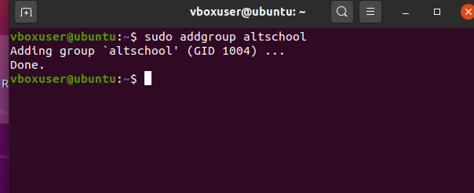
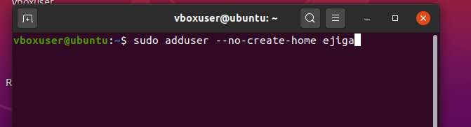

<!-- @format -->

# Assignment on Users,Groups and Permissions

I will be writing on how to perform the instructions that we given to us

### Prequisites

1. This assumes you are using an Ubuntu OS
2. some of the commands will need `sudo` privalges to be executed
3. The flag options are Case-Sensitive eg `-a` and `-A` will have different outcomes

## 1. Create a user

To create a user in linux, we use the `adduser` command.

```
:~$ sudo adduser <username>
```

replace `username` with your desired username that you wish to create


you will be prompted to fill in some information including setting a password


once that is done, you have succesfully created a new user

## 2. Set an expiry date of 2weeks for the user

After creating the above user, you can specify an expiry date for the account, this can be done using the using the `chage` command and also specifiying the `-E` flag.

```
:~$ sudo chage -E yyyy-mm-dd <username>
```

replace `username` with your desired username that you wish to create


## 3. Prompt the user to change thier password on login

To make sure the user creates a new password upon logging in, we use the `passwd` and the `-e` flag.

```
:~$ sudo passwd -e <username>
```

replace `username` with your desired username that you wish to create


once this is done, you will see a notification that its done


On next login the user will be prompted to input a new password.

## 4. Attach the user to a group called "altschool"

This step involves a few more steps, we need to create the group, and then add the group.

Firstly, We need to create a group:

To create a group we need to run the `addgroup` command to createa group

```
:~$ sudo addgroup <groupname>
```

replace `groupname` with your desired groupname that you wish to create


once this is done, you will see a notification that its done



Secondly, Add the user to the newly created group:
this can be achieved by using the `usermod` command with the `-aG` flag

```
:~$ sudo usermod -aG <groupname> <username>
```

replace `groupname` and `username` with your desired groupname and username that you wish to create


you can confirm the group(s) a user belongs to but using the `groups` command and specifiy the username

```
:~$ groups <username>
```


replace `username` with your desired username that you wish to create


as you can see the user is in the altschool group.

## 5. Allow altschool group to be able to run only cat command on /etc/

It get more tricky from here, in this case we need to edit a file called `visudo` and modify its permission... heres my way of doing this, However please becareful as you follow this type as wrong/bad edit can cause some serious damages

A. Use an editor to edit the content of `visudo`

```
:~$ sudo visudo
```

go to the end of file and the following

```
%altschool ALL=(ALL) /bin/cat /etc/*
```

should look like this


save exit and you are good to go

## 6. Create another user. make sure that this user doesn't have a home directory.

Similar to the `adduser` command this time around we need to add a different flag to create a user without the home directory, simply add the `--no-create-home` and this will create a user without a home directory

```
:~$ sudo adduser --no-create-home <username>
```

replace `username` with your desired username that you wish to create



you will get a notification


To confirm you can try signing in as the new user and you will be greeted with that error that the home directory doesnt exist


