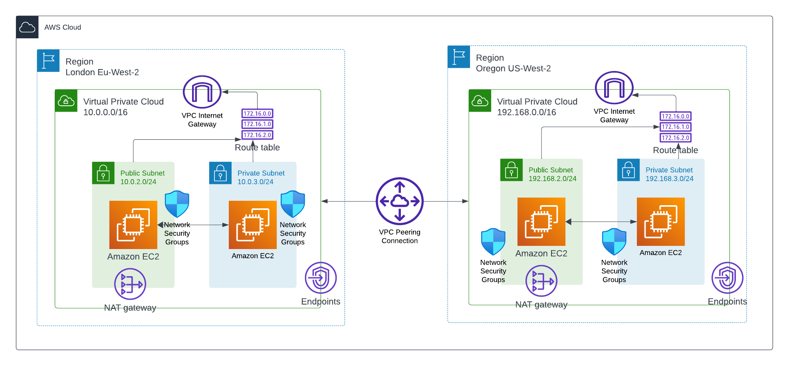

<!-- @format -->

# VPC to VPC peering

In this project we are going to create a VPC peering and connect 2 VPC's together,



As the name implies, lets get straight into it

# D. Connectivity Test

Now that we have set up our network,our compute and other infrastructure, we can go ahead and test connectivity between both regions.

Go ahead ssh into the server in the public subnet in the 1st vpc and then conduct a ping test to test connectivity to all other instances

```
:~$ ping <vm_private_ip_address>
```

In this case i used the private ip address of all other vms, so that it can be tested asif all the Instance are on the same network, this is from the 1st vpc to 2nd vpc


Same steps as above but from the 2nd vpc, this time around its from the 2nd vpc to the 1st vpc


With this we can confirm communication both ways from both VPC meaning that we have successfully created a vpc peering.

Enjoy!!!

🚧🚧🚧Dont forget to delete all your resources when you are done!🚧🚧🚧
