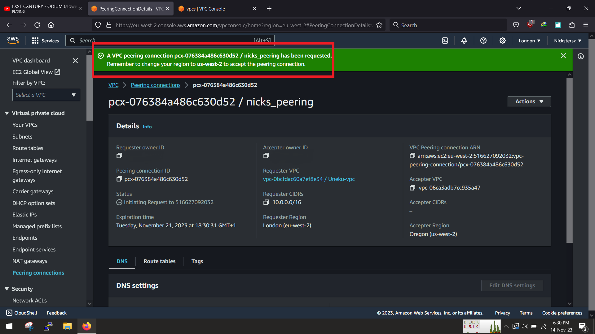

<!-- @format -->

# VPC to VPC peering

In this project we are going to create a VPC peering and connect 2 VPC's together,


As the title implies, lets get straight into it. We are going to

- Create 2 VPC'S (1 in 2 differents regions eu-west-2 and us-west-1)
- Create a VPC peering
- Update the route table

# A. Create VPC

The 1st step is to create a vpc, at the end of this step you can simply swap regions and follow the same steps below.

Head to the aws console, sign in and search for the vpc dashboard


Click on create a new vpc and select "vpc and more" (save us time than manually creating each componet)
for the 1st vpc we are going to use 10.0.0.0/16


For now we use 1 Az(availabilty zone), with 1 public and 1 private subnet, for the cidr we are going to use 10.0.3.0/24 and 10.0.4.0/24


Ensure to set the NAT gateway and vpc endpoints to none, as we are not going to use them for now and then go ahead and create the VPC


Once thats done we should have our vpc and all its components


As earlier mentioned, simply select the region at the top and change to another region and repeat the same steps above while changing the cidr so as to not cause an overlap in the address space


# B. Create Peering connection

Now in the vpc dashboard go to the peering connection and create peering.

NB: This can be done from any region, it just makes the intiating VPC the REQUESTER and the other other VPC the ACCEPTER.


Fill in the information with the name, then the vpc requester is the VPC that is initiating the peering request, so fill in the vpc id , then select the location of the other vpc which is this same account


Also select the other region of were the 2nd vpc is located and input the vpc id of the 2nd region, go ahead and create the peering.


You should get a notification, prompting you to go to the 2nd region and accept the peering connection



Swap to the other region


go to th vpc dashboard and then click on peering connection


Accept the peering


Thats it. We have successfully peered the 2 vpc

# C. Update routes and security groups

Now that we have our peering connection we need to update our route tables. we can also update our security groups to accept traffic from each vpc.

Head on to the VPC dasboard and update the route tables, (all the routes tables and in both VPC) Select route tables


add a route and then add the cidr of the opposite VPC, point the target to the peering connection, Perform these same action on the other vpc route tables


With this done now, our packets will now know which route to follow to get to the desired directions

# D. Create our instances (EC2)

Now that our network infrastructure is set up, we can now go ahead and create our instances. 4 instances 1 in each subnet in each vpc

On the console in the search bar, search for EC2 and navigate to it dashboard


select "launch instance"


give your server a name and select the instance OS type, for speed and ease i used ubuntu


select the instance type, configure the cpu cores and ram and also generate a key pair or use


For the 1st instance,we will place it in the new vpc and in the public subnet, which we will use and jump around all the servers


configure storage, which can be left as default for now, and then clock create instance


Repeat all the same steps placing each instance in each subnet i.e 1 in private and public subnet, also change to the other region and do same.

# E. Connectivity Test

Now that we have set up our network,our compute and other infrastructure, we can go ahead and test connectivity between both regions.

Go ahead ssh into the server in the public subnet in the 1st vpc and then conduct a ping test to test connectivity to all other instances

```
:~$ ping <vm_private_ip_address>
```

In this case i used the private ip address of all other vms, so that it can be tested asif all the Instance are on the same network, this is from the 1st vpc to 2nd vpc


Same steps as above but from the 2nd vpc, this time around its from the 2nd vpc to the 1st vpc


With this we can confirm communication both ways from both VPC meaning that we have successfully created a vpc peering.

Enjoy!!!

🚧🚧🚧Dont forget to delete all your resources when you are done!🚧🚧🚧
