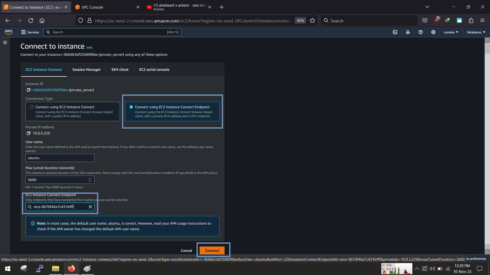
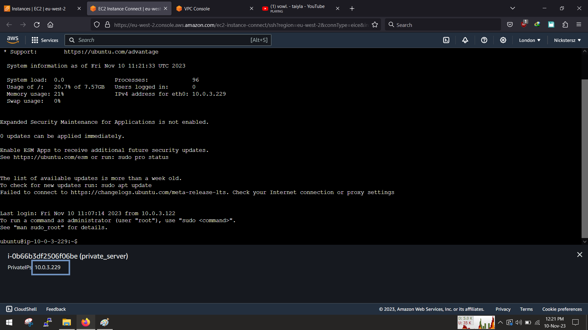

<!-- @format -->

# VPC With public and private subnets and an EC2


# E. Connect and ping each VM

### Test Connectivity between vms

Now that the vms have been created, we can now connect to them using the endpoint link that we created, so go to the ec2 dashboard, select a vm and click on connect


Most of the values are already filled in, simply select the "connect using...endpoint", select the actual endpoint and then click connect



Another browser window should open up and a view of a terminal into your vm. Great we are in.



To test that we can communicate to the both vm from each other, we can use the ping command to test

```sh
:~$ ping <VM_PRIVATE_IP_ADDRESS>
```

From the 1st vm we can succesfully ping the other vm, we also ping from the other vm too.


Also we can ping the previous vm from the second vm


With this we are now sure that both vms can communicate with each other via the private ip addresses assigned to them.

Enjoy!!!
