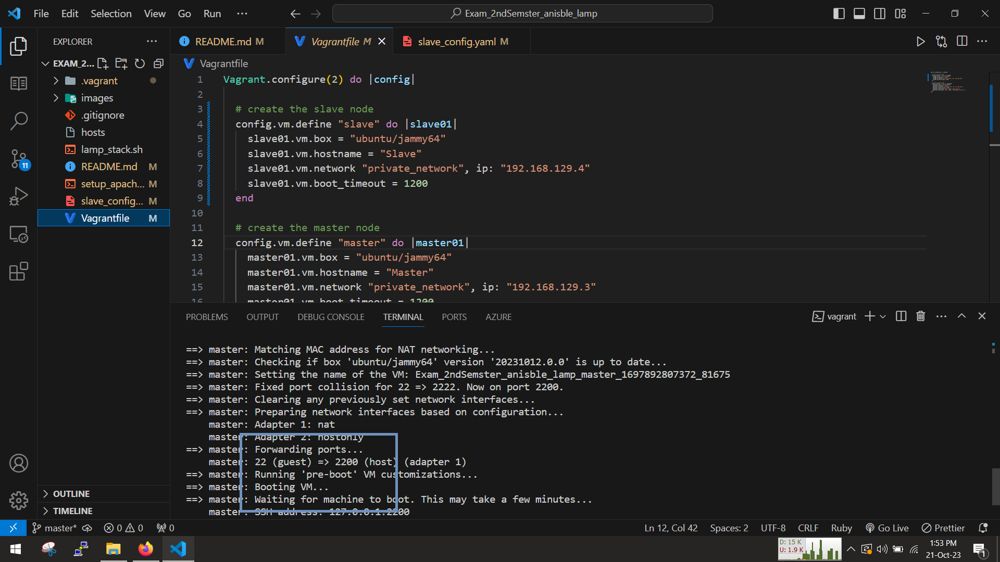
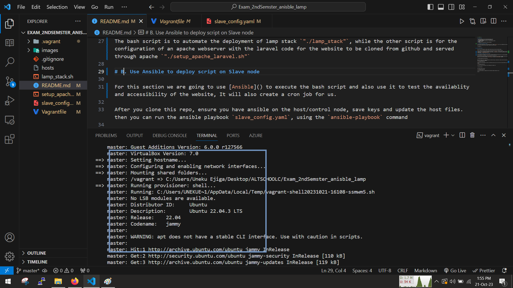

<!-- @format -->

# 2nd Semster Exam

# Laravel Webserver

## Prerequisites

1. A PC or laptop with any OS installed(preferrably linux).
1. About 6gb of RAM or more (the more the better&&faster)
1. An Internet connection.
1. A compatible hypervisor installed eg. Virtualbox,VMware, hyper-v.
1. Vagrant installed.
1. Ansible
1. A code editor of your choice, in this case Vscode.

# A. Automate provisioning of ansible

To set up this infrastructure, you can simply use 1 command `vagrant up` and it will automatically provision and configure the master and slave nodes, leaving the slave node clean

```
:~$ vagrant up
```

### 1. Master Node

First of all, we are going to create a master node, which will serve as the control plane

From our vagrant file under the master section,we have some bash scripts to automate the setup


The bash script is to automate the deployment of lamp stack `"./lamp_stack"`, while the other script is for the configuration of an apache webserver with the laravel code for the website to be cloned from github and served through apache `"./setup_apache_laravel.sh"`



Once the vm has been provisioned, we will also allow vagrant to automate the configuration




Once its done configuring we can visit the `http://VM_IP_ADDRESS` in our browser and see the default laravel page

#### Side Note

You can either choose to run ansible from your host machine or you can choose to use the master node to configure the slave node.

Since we are using vagarant in this guide, we can use this command to copy the key from master and save it to slave, so as to enable easy and seamless ssh between the master and the slave, as ansible needs to be able to communicate to the slave

Step1

```

```

Step2

```

```

# B. Use Ansible to deploy script on Slave node

For this section we are going to use [Ansible](https://docs.ansible.com/ansible/latest/installation_guide/installation_distros.html#installing-ansible-on-ubuntu) to execute the bash script and also use it to test the availablity and accessibility of the website, It will also create a cron job for us.

After you clone this repo, ensure you have ansible on the host/control node, save keys and update the host files. then you can run the ansible playbook `slave_config.yaml`, using the `ansible-playbook` command

```
:~$ ansible-playbook slave_config.yaml
```

While the ansible script is being executed you can check the logs, we should see a status code of 200, which means the site is available and reachable


as you can see we used ansible to check its accessibility and also you can visit the site using the VM_IP in your browser


we can also confirm the cronJob is set by checking the cronjobs list

```
:~$ sudo crontab -e
```

the outcome should like this


In this way the project is complete but only accessible through localhost for now.

Enjoy!!!
