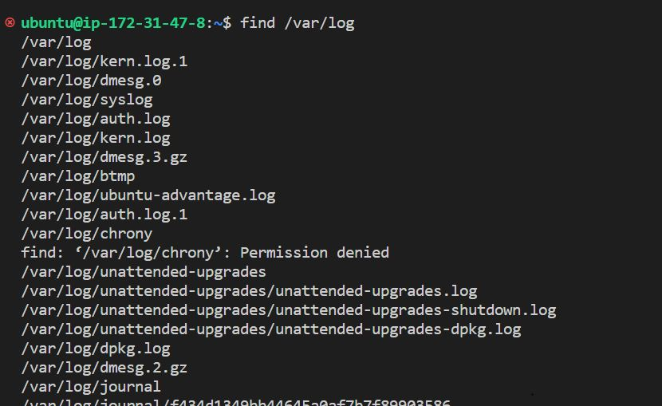
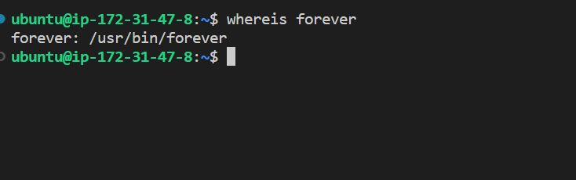
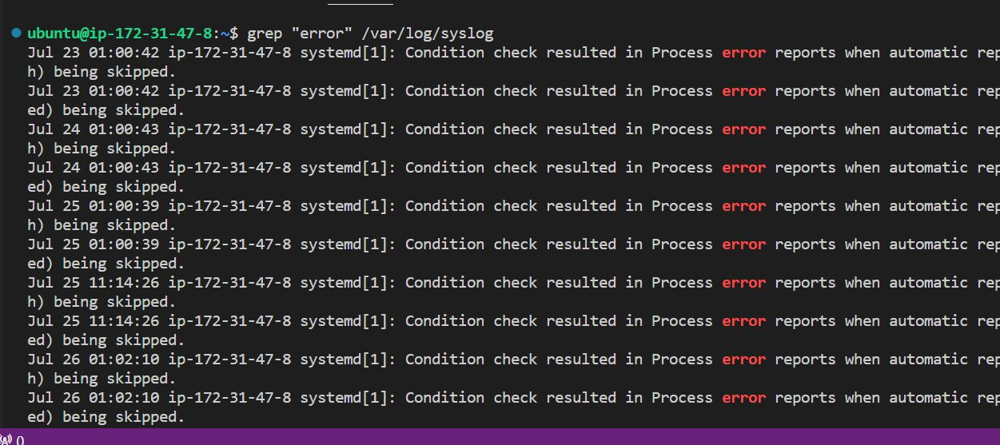
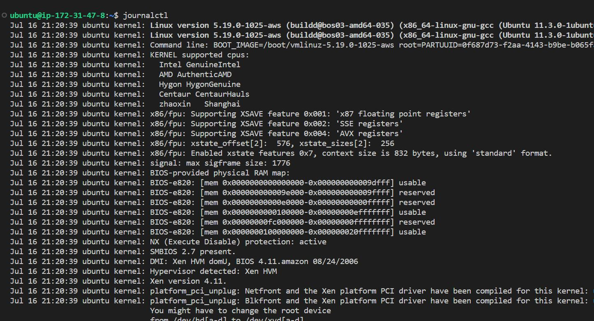
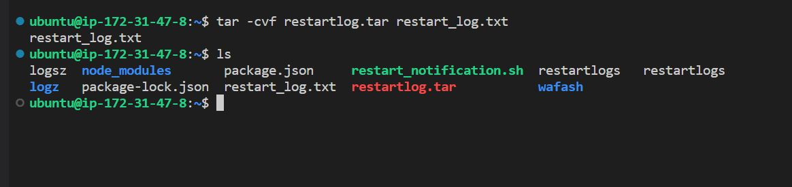
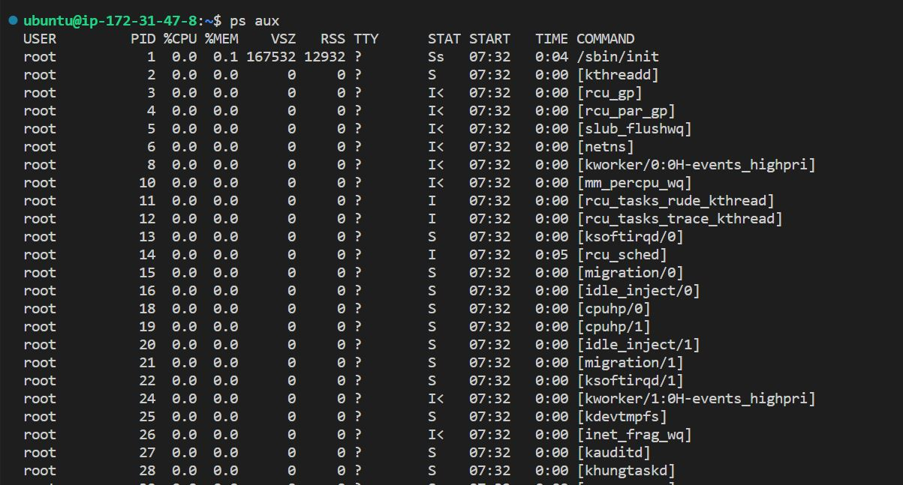
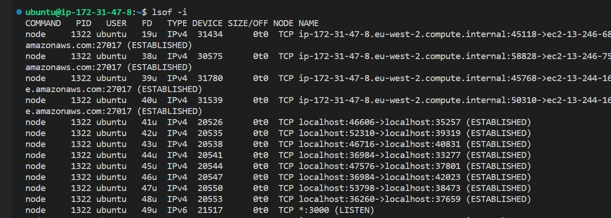
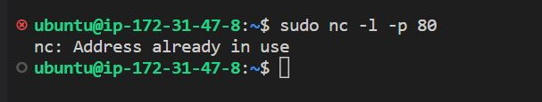
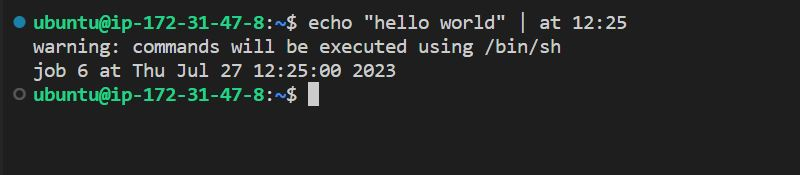

<!-- @format -->

# LINUX Commands

This article showcases 10 Linux commands and their uses

🚧🚧NB: Some of these commands need extra options (flags) to properly execute..you will notice them in the images eg "-i"🚧🚧

### 1. `find`:

Searches for files and directories based on various criteria like name, size, type, etc., within a specified directory and its subdirectories.This command is useful for locating files scattered throughout the system and performing actions on them.

```
:~$ find
```

Output:



In this section i executed the `find` command to find the directories that belong to /var/log

### 2. `whereis`:

Locate binary, source, and man page files for a specified command or program. The whereis command is used to find the locations of the executable binary, source code, and man page files associated with a given command or program. It helps you discover where a particular program is installed on your system.

```
:~$ whereis
```

Output:



In this section i executed the `whereis` and it showed me the location of the binaries for the "forever" command

### 3. `grep`:

Searches for patterns within text files, allowing you to filter and extract specific lines that match the given pattern. This command is incredibly useful for parsing log files, searching codebases, and finding specific information in large text files.

```
:~$ grep
```

Output:



In this section i used the grep command to search a file caled syslogs and gilter the ones that had an error log in the output

### 4. `awk`:

A versatile text processing tool that allows you to manipulate and analyze structured data in files, using custom scripts. It's often used for data extraction, reporting, and data formatting tasks.

### 5. `journalctl `:

A command-line utility in Linux systems that allows you to query and view logs from the systemd journal. The systemd journal is a centralized logging system that stores log data from various services and processes on the system.

```
:~$ journalctl
```



### 6. `tar`:

A command-line tool for archiving files and directories into a single tarball, which can be compressed further using other utilities like gzip or bzip2. This is commonly used for creating backups, distributing files while preserving permissions, and archiving multiple files together.

```
:~$ tar
```



in this image, i executed the tar command to zip the restart_log.txt file into restartlog.tar

### 7. `ps`:

ps is a command-line utility for displaying information about running processes.This will display a list of all running processes along with details such as process IDs, resource usage, and associated users.

```
:~$ ps
```



### 8. `lsof`:

Lists open files and the processes that have them open, including regular files, directories, and network sockets.This helps in troubleshooting and identifying processes that might be causing issues with specific files.

```
:~$ lsof
```



In this section i used the lsof command to display a list of proccess and services currently running .

### 9. `nc (netcat)`:

A powerful networking utility that can be used for port scanning, transferring data over network connections, or setting up simple servers. It's commonly used for testing network connectivity and debugging network-related problems.

```
:~$ nc
```



the nc command was used here however :80 was already in use

### 10. `at`:

Schedules commands to be executed at a specified time in the future. This command is useful for automating tasks that need to run once at a specific time, without the need for a full-featured cron job. it usually used in a sentence of a command

```
:~$ at
```



In this image i used the `at` command to set a time for the `echo` command to be executed
