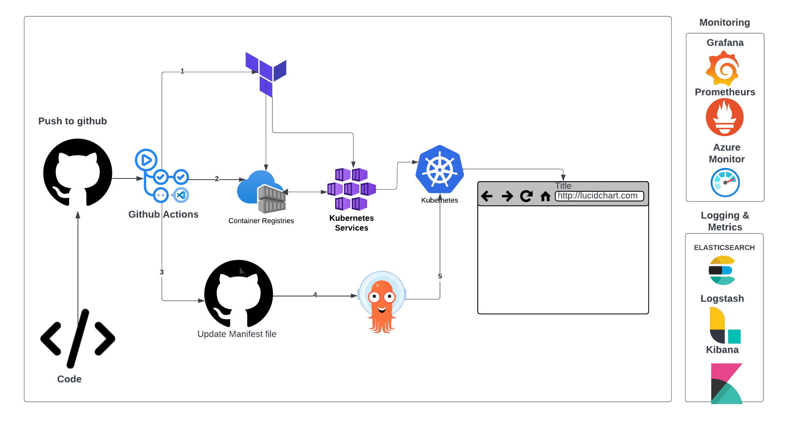
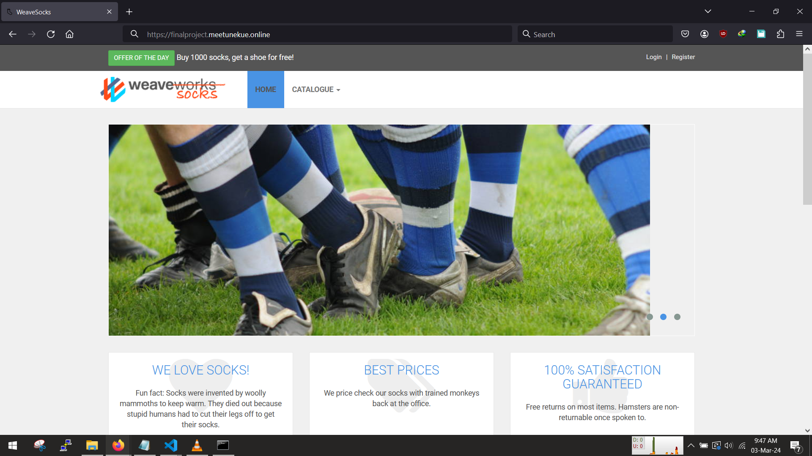

<!-- @format -->

# Capstone Project: Sock Shop, A Microservice Demo Application

The application serves as the user-facing component of an online store specializing in sock sales. Its primary purpose is to facilitate the demonstration and testing of microservice and cloud-native technologies.

The application is constructed using Spring Boot, Go kit, and Node.js, and it is packaged within Docker containers and deployed on kubernetes cluster in AKS

## Deployment steps

The [install folder](./install/) contains scripts to install the needed cli tools

The [infrastructure folder](./infrastructure/) contains scripts to provision the infrastructure(aks,acr,VM).

The [.github folder]() contain the deployment scripts using github actions

The [monitoring]() contains the manifest file for monitoring, also see readme

The [logging]() contains the manifest file for logging

## Visualizing the deployment pipeline

## Screenshot of application deployed

