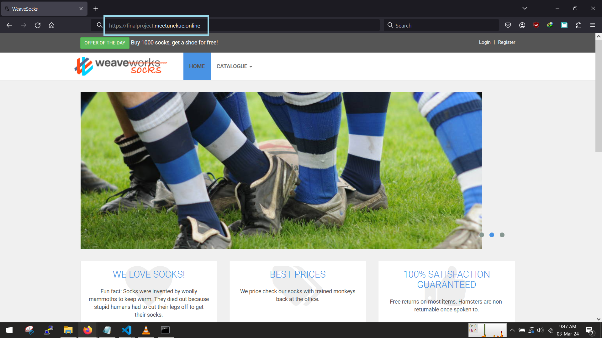

<!-- @format -->

# Capstone Project: Sock Shop, A Microservice Demo Application

## Deployment Platforms

The [install folder](./install/) contains scripts and to install the needed cli tools

The [deploy folder](./deploy/) contains scripts and instructions to provision the application onto your favourite platform.

## Visualizing the deployment application

## Screenshot of application deployed

