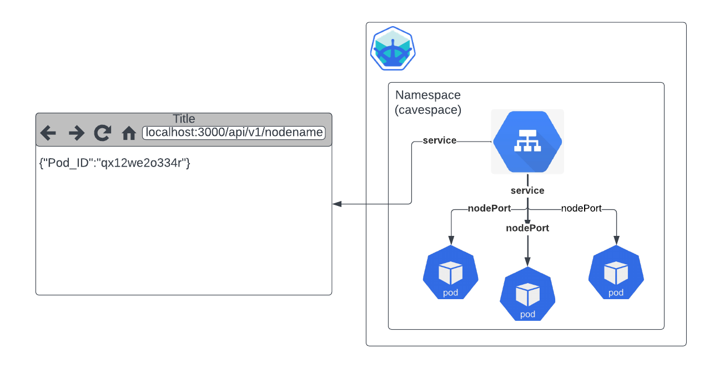

<!-- @format -->

# Kubernates-minikube-cluster



### Requirements

1. A VM/server with atleast 2core-cpu and 2gb ram
2. Docker installed
3. kubectl installed
4. minikube installed

For this Kubernates we will be deploying a simple nodejs application a websever that returns the `Pod_id`, for the deployment will be using `minikube`.

before we procced to running the deployment ensure that you have [Docker](https://), [Minikube](https://), [kubectl](https://) installed on the VM, as these are the needed tools to run the deployment.

After you have these installed, we can create our deployment and service manifest files for the deployment

To start off, let briefly look at the service manifest file `caveman-service.yaml`

```yaml
apiVersion: v1
kind: Service
metadata:
  name: caveman
spec:
  selector:
    app: caveman
  ports:
    - protocol: TCP
      port: 3000
      targetPort: 3000
  type: NodePort
```

we are creating a service manifest file with a type of nodePort, this give us access to communicate directly to a worker node from the browser. An example the flow of the service will be:

```
browser(:3000) -> NodePort(:30234) -> Pod(:3000)
```

Next our deployment manifest file, is a blueprint for the deployment, i.e the details of the worker node and the pod specifications and ports, volumes and other need components for our cluster

let briefly look at the deployment manifest file `caveman.yaml`

```yaml
apiVersion: apps/v1 # The version of the deployment
kind: Deployment # The kind of manifest file, deployment,services,configMap etc
metadata: # The details
  name: caveman
spec: # The specification of the deployment,including replicas,selectors,templates
  replicas: 3
  selector:
    matchLabels:
      app: caveman
  template:
    metadata:
      labels:
        app: caveman
    # the spec below is the spec of the container images with other details like ports,env,limits etc
    spec:
      containers:
        - name: caveman
          image: nickstersz/caveman:1.1 # Docker image from dockerhub or any repository
          ports:
            - containerPort: 3000
```

- metadata: this are details of deploymeny such as name,type,labels etc
- spec: this provides the operations of the deployment, the replicas and other
- template: the template and spec at this point defines the pod details, the container to run,the port details, the image to use and other env variables and etc that the pod will need to function and communicate

Now that we have a bit of understanding, we can now deploy our manifest to our kubernates cluster and watch our deployments being created

since we have minikube and kubectl we can apply our manifest files using the `apply` command.

NB: make sure you are in the same directory of the manifest file before executing this command

```
:~$ kubectl apply -f caveman.yaml
```

or

```
minikube kubectl -- apply -f caveman.yaml
```

then you should get a prompt saying

img
img
img

repeat the same with the service manifest file

```
:~$ kubectl apply -f caveman-service.yaml
```

or

```
:~$ minikube kubectl -- apply -f caveman-service.yaml
```

then you should get a prompt saying

img
img
img

Once that is done you can check the state of the pods and service ensuring everyhing is running,
we can use the `get pods` command to check

```
:~$ kubectl get pods
```

img
img
img

repeat same for service, and ensure we have type nodePort

```
:~$ kubectl get svc
```

img
img
img

Now that all pods are up and the service is up, for a local deployment we will make use of portforwarding, in Production we would actually use `ingress` but for now we will use minikube to port forward our services, so we can use the `kubectl port-forward service/<service-name> <host-port>:<container-port>` command an example below

```
:~$ kubectl port-forward service/caveman-service 3000:3000
```

or

```
:~$ minikube service caeman-service
```

Open your browser and then visit `localhost:<port>`

and we should see our endpoint
