<!-- @format -->

# Holiday Project

## ALB balancing traffic to 2 or more webserver

    
    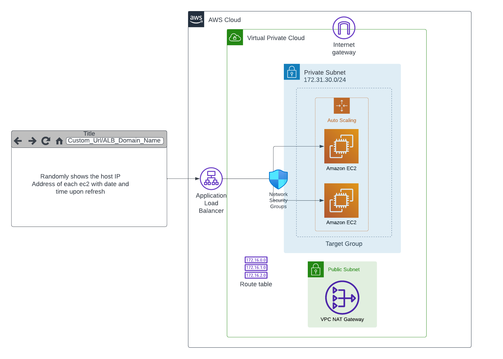

## Prerequisites

Create vpc
create empty target group
create autoscaling group, (create launch template 1st, then later add to traget group)
create loadbalncer
simulate asg taking action

# A. Create VPC

Navigate to the VPC console by searching for VPC, and then click on "create vpc"

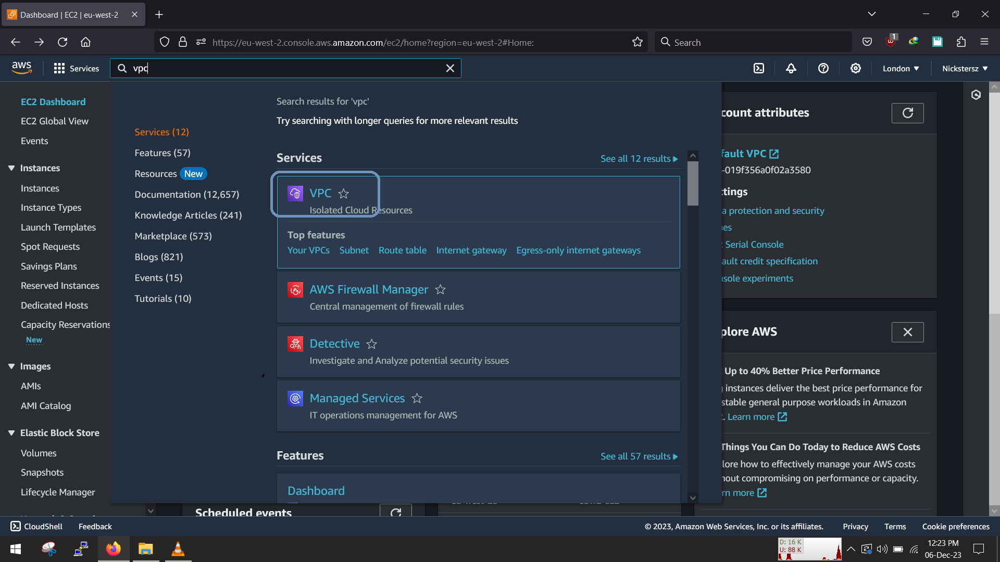

To speed things up, select vpc and more and then let us quickly create our own custom vpc

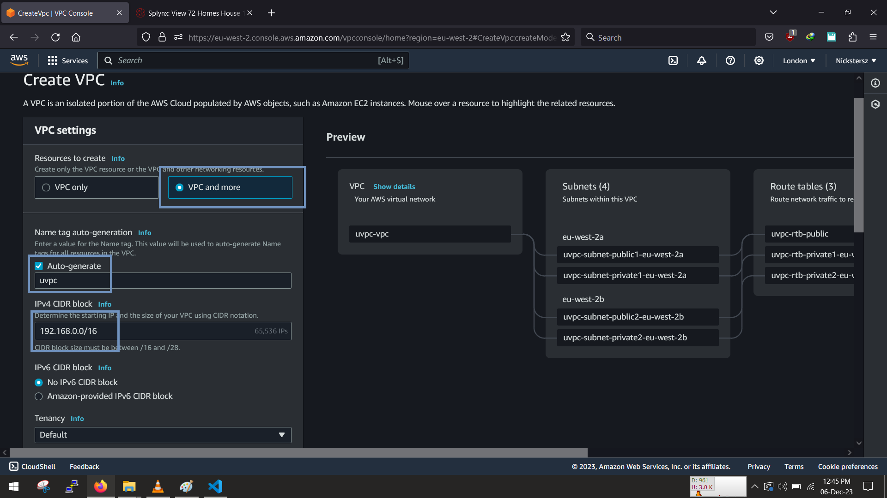

we will set up 2 public and 2 private networks across 2 availaibilty zones, so that we can achieve high availablity and fault tolerance

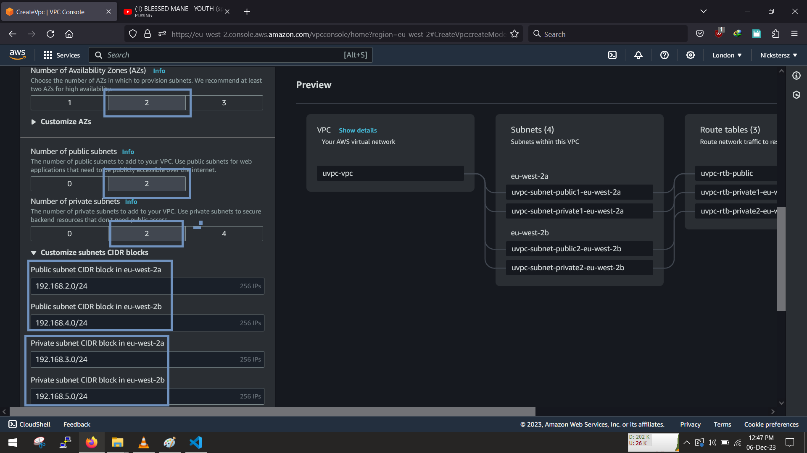

Finally, we need a NAT Gateway for the private instances to be able to access the internet for updates installs, No need for s3 gateway at this time

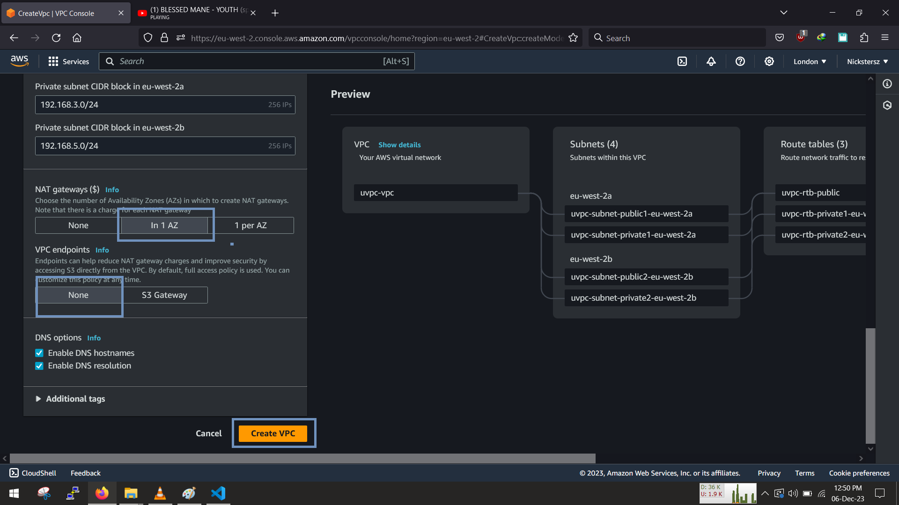

Great, we have our own custom vpc

# B. Create Target Group

Think of the target group as the pool of resources that the loadbalancer is going to evenly distribute the traffic to.

At this point we are going to create an empty target group and then attach the autoscaling group to it later, so that as the autoscalling group is increasing/decreasing in size the loadbalancer will automatically detect it,check its health and evenly distribute traffic

Click on Target groups in the ec2 console and lets start

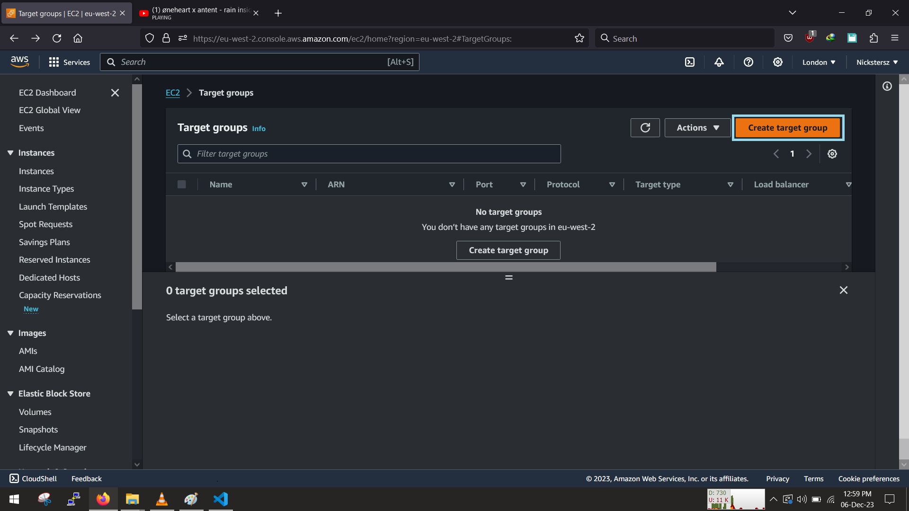

We are using instances for our webserver... select instances, scroll down and continue

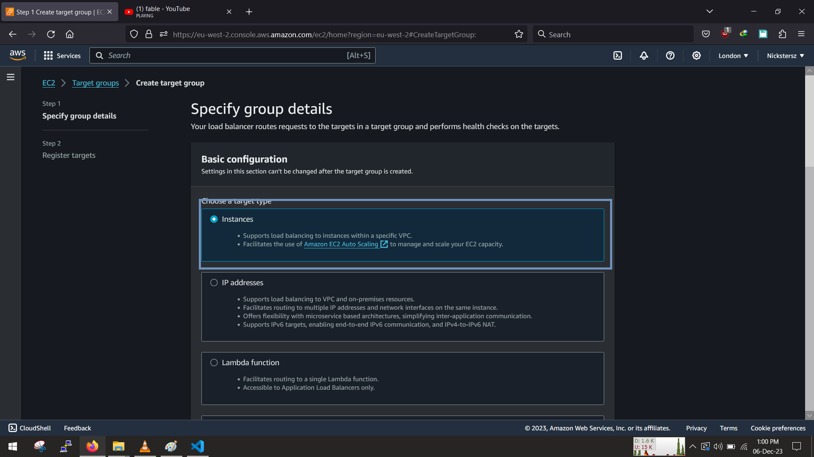

Fill in the name of the Target group and then we set the protcol to HTTP via port 80 (this is for demo purposes, in a production enviroment we would use HTTPS via port 443), then set the IP version to ipv4.

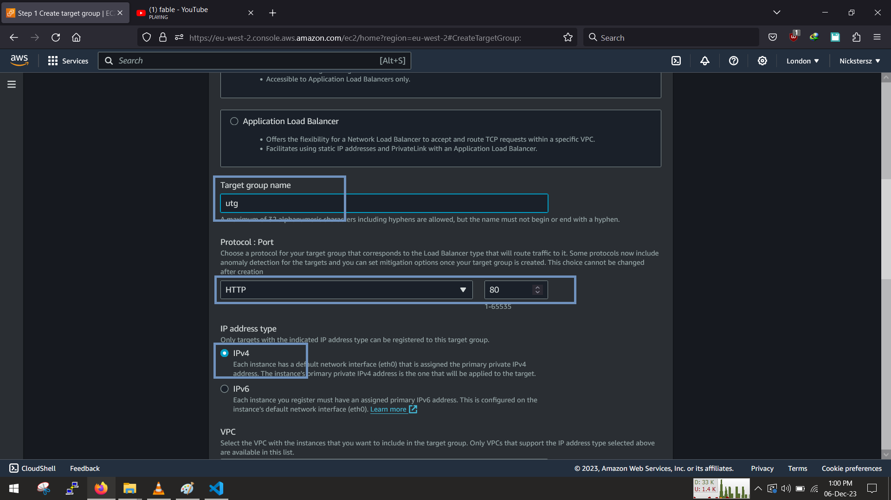

As for the VPC, select our own customs vpc that we created and set the http protocol to http1, enable the health check and set the path to `"/"`

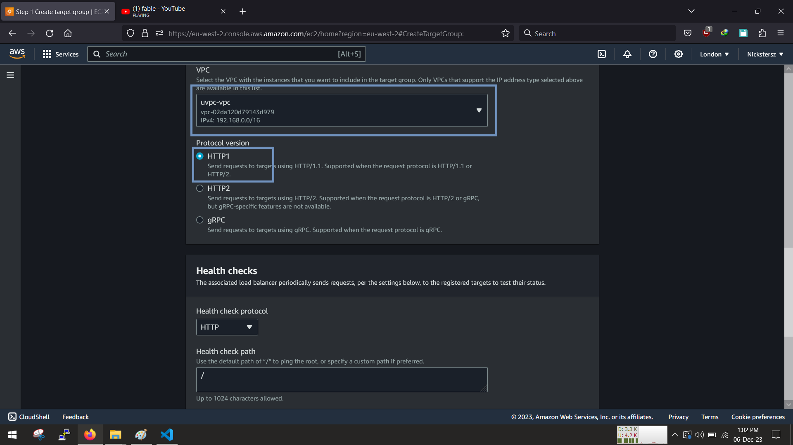

At this point we are going to leave it empty and wont register any targets to the target group,so leave it empty and click create target group

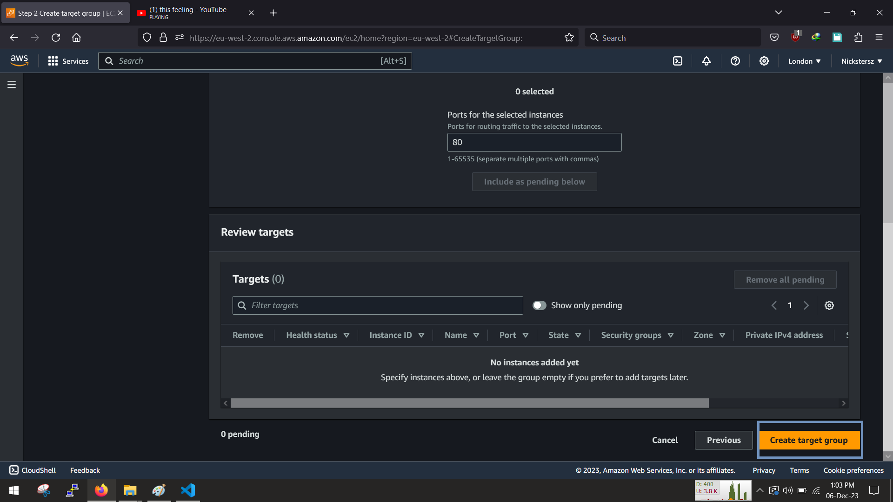

We now have an Empty target group, which we will later add the autoscaling group into the target group

# D.Create the loadbalancer

Last but not the least, we can create our loadbalancer after setting up the rest of our infrastructure

# E. Simulate Auto-scaling taking action

I knows it been long read, for the last part we are going to test out a simulation of an autoscaling group.

Usually when an instance is unhealthy or not responding,a new instance replaces the faulty one, so to simulate this we will go to the EC2 dashboard and terminate one of the instances

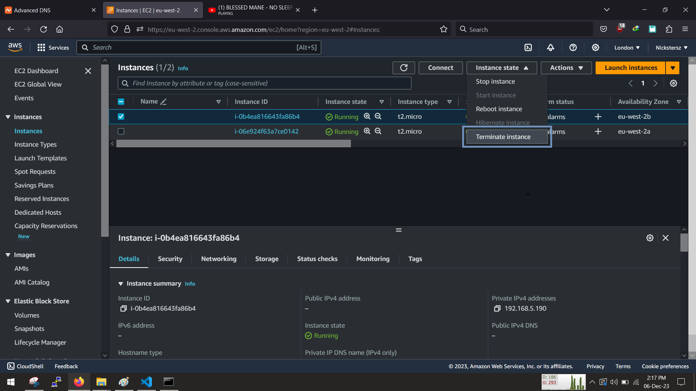

Once we terminate the instance the loadbalancer will continue to perform its health checks periodically, once it notices that an instance is unhealthy. it will notify the ASG and get another instance to replace it

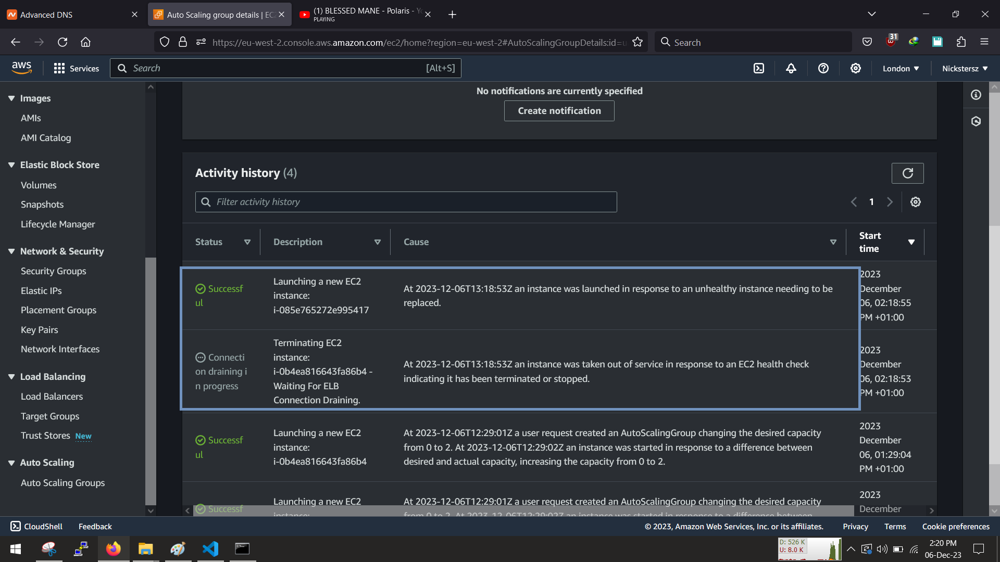

we can now see another instance will be brought up to replace the previously terminated one.

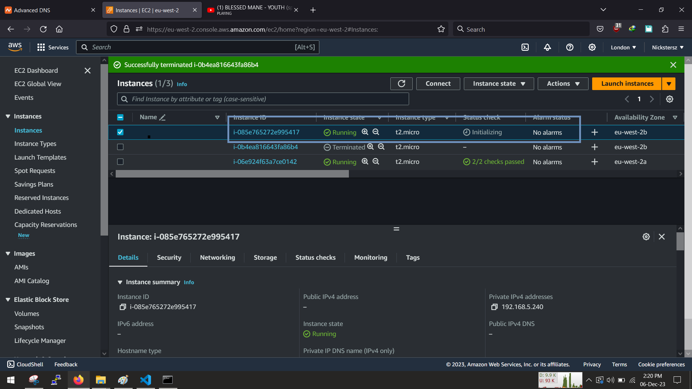

Great, we have succesfully simulated an asg taking action in response to a failed/unhealthy instance

Enjoy!!!

🚧🚧🚧Dont forget to delete all your resources when you are done!🚧🚧🚧
