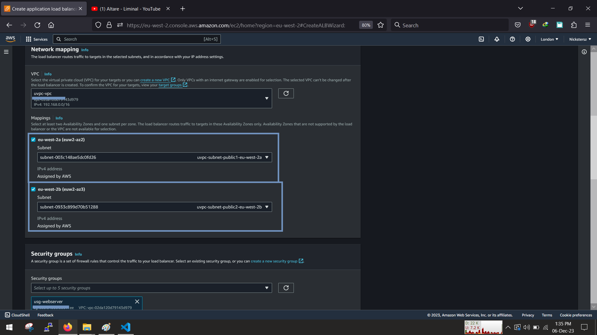

<!-- @format -->

# Holiday Project

## ALB balancing traffic to 2 or more webserver

    
    

## Prerequisites

- Aws Account
- willingness to laern

### We would be creating our infrastructure in this order

1. Create vpc
1. create empty target group
1. Create autoscaling group, (create launch template 1st, then later add to traget group)
1. create loadbalncer
1. simulate asg taking action

# A. Create VPC

Navigate to the VPC console by searching for VPC, and then click on "create vpc"

To speed things up, select vpc and more and then let us quickly create our own custom vpc

we will set up 2 public and 2 private networks across 2 availaibilty zones, so that we can achieve high availablity and fault tolerance

Finally, we need a NAT Gateway for the private instances to be able to access the internet for updates installs, No need for s3 gateway at this time

Great, we have our own custom vpc

# B. Create Target Group

Think of the target group as the pool of resources that the loadbalancer is going to evenly distribute the traffic to.

At this point we are going to create an empty target group and then attach the autoscaling group to it later, so that as the autoscalling group is increasing/decreasing in size the loadbalancer will automatically detect it,check its health and evenly distribute traffic

Click on Target groups in the ec2 console and lets start

We are using instances for our webserver... select instances, scroll down and continue

Fill in the name of the Target group and then we set the protcol to HTTP via port 80 (this is for demo purposes, in a production enviroment we would use HTTPS via port 443), then set the IP version to ipv4.

As for the VPC, select our own customs vpc that we created and set the http protocol to http1, enable the health check and set the path to `"/"`

At this point we are going to leave it empty and wont register any targets to the target group,so leave it empty and click create target group

We now have an Empty target group, which we will later add the autoscaling group into the target group

# C. Create An Autoscaling group

An Auto Scaling group contains a collection of EC2 instances that are treated as a logical grouping for the purposes of automatic scaling and management

We can now create our compute infrastructure which will hold our webservers.

Navigate to the EC2 dashboard and select Autoscaling group.

## Create launch template

Before we create an auto-scaling group, We need to create a launch template, the launch template is going to be the standard configuration for provisioning instances i.e anytime the autoscaling group is creating a new instance, it will provision and instance according to the specified configuration

Navigate back to the EC2 dashboard and select launch template and click create launch template

Set a name and description for the template and check the box that sets up guidiance for the template

for the purpose of this demo, please stick to free-tier resources, Select the Ubuntu OS

choose the instance size and the key-pair

For the network settings here are few things we are setting up

- Leave the subnet section as "dont include"(this will be adjusted in the asg steps)
- Create a new security group(if you dont have one)
- Give the sg a name a descriptions
- Select our custom vpc
- allow a rule that allows http traffic from anywhere (later we can create another sg for the loadbalancer and then adjust it to recieve traffic from only the loadbalancer)

Scroll down, click on advanced details then scroll down to userdata and input the userdata

The userdata here is to install nginx and display a webpage with the instance hostname. Once done click "create launch template"

Now we can navigate to the EC2 dashboard and select Autoscaling group.

Give your asg a name and select the launch template we just created, next

Foe the network settings, select our custom vpc and then select only the 2 PRIVATE subnets and then click next

On this next section, we are going to add the autoscaling group to the target group but not yet to the loadbalancer, However select "attach to existing loadbalancer", this will bring out the option which will give you a window to add the asg to target group that we created earlier on.

for now we dont need the vpc lattice but check the box that will allow elb health checks

Now we get into the size and metrics of the asg,

For the group size we want to have atleast 2 running instances. so we set the desired capacity to be 2

We want to have a minimum of 2 instances and a max of 3 instances, and also we want a target tracking scaling policy. for the metric we are going to use is as follows

- if Average CPU utilisation is > 90%, then scale out (add another instance)

for the instance maintainance policy leave it as "no policy". Once you are done click next, review and then create the asg

Once its done. you can check the activity tab and also check and see the instance that was auto created

# D. Create the loadbalancer

Last but not the least, we can create our loadbalancer after setting up the rest of our infrastructure

On the EC2 console page, select loadbalancer and click "create loadbalancer"

select the type of loadbalancer, in this case select application loadbalancer

Give your loadbalancer a name and set the scheme to internet facing (as it a public loadbalancer accepting request from over the internet) and IPv4 as the address type

For the network settings ensure to select our custom created vpc and select the 2 public subnets also select thr webserver-sg like before that the only rule to allow traffic to port 80

next setup the listner and router, to listen to traffic on port 80 with http protocol and let it route traffic to our target group, (the group that has the auto-scaling group in it)

Review the configuration then click create

The Loadbalancer will take about 7-10mins to create,so be patient

Once it created, copy the DNS name and then paste it a browser

Great it works! now keep refreshing and watch as the traffic alternate between both instance

With that we have succefully created a loadbalancer and are routing traffic between our resources in our asg

## Convert loadbalancer dns name to normal DNS name

This step will vary according to your DNS provider but in my case i am using [Namecheap](https://www.namecheap.com/), what you need to do is to add a CNAME record and allow it a few minutes for the record to reflect

After some minutes visit the newbdns name from your provider. in my case it was [loadbalancer.meetunekue.online]()

Great. we now have our own custom dns name instead of the aws alb dns name

# E. Simulate Auto-scaling taking action

I knows it been long read, for the last part we are going to test out a simulation of an autoscaling group.

Usually when an instance is unhealthy or not responding,a new instance replaces the faulty one, so to simulate this we will go to the EC2 dashboard and terminate one of the instances

Once we terminate the instance the loadbalancer will continue to perform its health checks periodically, once it notices that an instance is unhealthy. it will notify the ASG and get another instance to replace it

we can now see another instance will be brought up to replace the previously terminated one.

Great, we have succesfully simulated an asg taking action in response to a failed/unhealthy instance

Enjoy!!!

🚧🚧🚧Dont forget to delete all your resources when you are done!🚧🚧🚧
