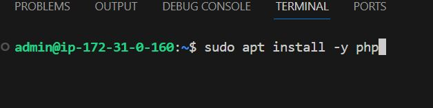
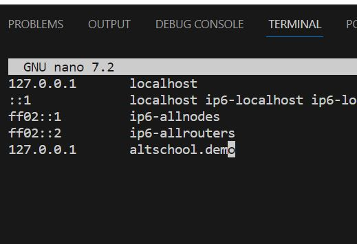

<!-- @format -->

# Mini Laravel real world project

In this project we are going to deploy a backend server made using the laravel language.

Requirements

- A host system with the Debian OS installed
- A domain and subdomain name
- willingness to learn

There are a lot of steps involved so lets get right into it

# 1. Install dependencies/requirements

Debian is quite light-weight...so we are going to install all the dependencies.

We need to install

- php
- apache2
- mysql/mariadb
- composer
- php sub-dependices eg php-curl,php-xml and others

We will NOT be using docker or sail as instructed

# A. Php

To install php use the `apt` command with `sudo` to do this, `sudo apt install php`

```
:~$ sudo apt install php
```



should look like this while installing


Once its done we can check and confirm by using the `php -v` command

```
:~$ sudo apt install php
```


and heres the outcome


the sub-dependencies will be installed when we are installing composer

# B. Apache2

To install apache2 use the `apt` command with `sudo` to do this, `sudo apt install apache2`

```
:~$ sudo apt install apache2
```


# C. Mariadb

Mariadb is a fork of mysql and operates fairly the same way, we will be using mariadb for now

To install mariadb use the `apt` command with `sudo` to do this, `sudo apt install apache2`

```
:~$ sudo apt install mariadb-server
```


Once its done, check the version using the `--version` flag

```
:~$ sudo apt install mariadb --version
```


# D. Composer

Before we install composer ther are other few php dependencies that composer needs, such as php php-cli php-json php-common php-mbstring php-zip unzip php-curl php-xml.

```
:~$ sudo apt install php-cli php-json php-common php-mbstring php-zip unzip php-curl php-xml
```

Once done, we can now `curl` the setup from the composer site

```
:~$ php -r "copy('https://getcomposer.org/installer', 'composer-setup.php');"
```

After thats done, we can now finally install composer (globally)

```
:~$ sudo php composer-setup.php --install-dir=/usr/local/bin --filename=composer
```

To verify that Composer is installed correctly, run the following command:

```
:~$ composer --version
```

Now that we have our dependencies we can now start setting up the server to serve and host our backend application

# 2. Setting up application

Before we move to setting up the webserver, we need to make sure our application is running smooth. So clone the [Laravel realworld](https://github.com/f1amy/laravel-realworld-example-app) repo that we are going to use then,

- Install the dependecies,
- Update .env
- Populate the db
- Test the application

# A. Clone the repo

Use the `git clone` command to clone the repo into our system

```
:~$ git clone <repoUrl>
```


it succefully download


we can use the `ls` command to view the contents and we can see that its a laravel application


# B. Install dependencies

We can now use composer to install the dependencies, We run it using the `composer update`, ensure to run this command in the root directory of the app

```
:~$ composer update
```


Let it run it course.

# C. Update .env

Update the .env by updating the db section with the details, for now we are going to use localhost and local users details and password

these are local details just for test...

```
DB_CONNECTION=mariadb
DB_HOST=localhost
DB_PORT=3306
DB_DATABASE=laravelrealworld
DB_USERNAME=altschool
DB_PASSWORD=altschool123
```

and also generate the appkey for the application, you can get a random key from the key generator site [link](https://generate-random.org/laravel-key-generator)

```
APP_NAME="Laravel Realworld Example App"
APP_ENV=local
APP_KEY=base64:ChJ5652Wmtx2EHCkSf8lkaeewVUBWh6H81ZgALJ/dYI=
APP_DEBUG=true
APP_URL=http://localhost
APP_PORT=8000
```

# D. Populate the DB

Before we can test the application lets us populate the db with some sample data. Simply run the `php artisan migrate --seed`.

ensure to run this command in the root directory of the app

```
:~$  php artisan migrate --seed
```

once its sucessfuly populated, we can now test the application

# E.Test the application

Finally we can test the application and make sure it running.

To run the laravel application, you use the `php artisan serve` command

ensure to run this command in the root directory of the app

```
:~$  php artisan serve
```


Great, now we can visit 127.0.0.1:8000 in our browser which show us the default laravel page


# 3. Setting up the Webserver

Now for the main part... instead of serving the application on port 8000, we are going to make it more streamline and make it serve from our webserver, here is an outline of this proceess

- disable apache default site and enable our new site
- create our new site directory and copy the content and give it permissions
- visit our site using our domain/host name

### A. Disable apache default site

To disable the default site we run the `/usr/sbin/a2dissite` command

```sh
/usr/sbin/a2dissite 000-default.conf
```

this will disable the default 'it works" page

Before we enable a new site, we need to create a configuration file aka .conf file. so navigate to the sitesenable file and then create a newfile using the `touch` command and any editor of your choice

navigate to sites-avaiable directory

```
:~$ cd /etc/apache2/sites-available
```

then create the file

```
:~$ touch <site-name>.conf
```

create your config file and add these details inside woth your editor of choice

```
:~$ nano <site-name>.conf
```

```
<VirtualHost *:80>
    ServerAdmin webmaster@example.com
    ServerName <site-name>.local  # Replace with your domain or server's IP address

    DocumentRoot /var/www/<site-name>/public  # Replace with the path to your Laravel public directory

    <Directory /var/www/<site-name>/public>  # Adjust this path to your Laravel public directory
        Options -Indexes +FollowSymLinks
        AllowOverride All
        Require all granted
    </Directory>

    ErrorLog ${APACHE_LOG_DIR}/<site-name>-error.log
    CustomLog ${APACHE_LOG_DIR}/<site-name>-access.log combined

    <IfModule mod_dir.c>
        DirectoryIndex index.php
    </IfModule>
</VirtualHost>

```

after thats done we can now enable the new site we run the `/usr/sbin/a2ensite` command

```sh
/usr/sbin/a2ensite <site-name>
```

### B. Copy the content to our /var/www/ directory

1st create the directory

```sh
:~$ mkdir -p /var/www/<site-name>
```

at this point you can copy the files from the already cloned repo in the home directory or you can navigate into the `/var/www/<site-name>` clone the repo, install the dependencies and update the .envs

i would be copying mine from the cloned repo of the home directory to `/var/www/<site-name>`

lest we forget, give permission to the files and directories

replace with your own details

```sh
sudo chown -R <server-user>:www-data /var/www/example.com/
sudo find /var/www/<site-name>/ -type f -exec chmod 664 {} \;
sudo find /var/www/<site-name>/ -type d -exec chmod 775 {} \;
sudo chgrp -R www-data storage bootstrap/cache
sudo chmod -R ug+rwx storage bootstrap/cache
```

Reload apache when done

```
:~$ sudo systemctl reload apache2
```

Finally,you vist your browser with either
`localhost`,`127.0.0.1`,domainName without the port number


We have succesfully set up our backend webserver.

To edit the hosts file you can go to `/etc/hosts`

**Note** this wont be accesible on the internet.

```
:~$ nano /etc/hosts
```



Enjoy!!!
