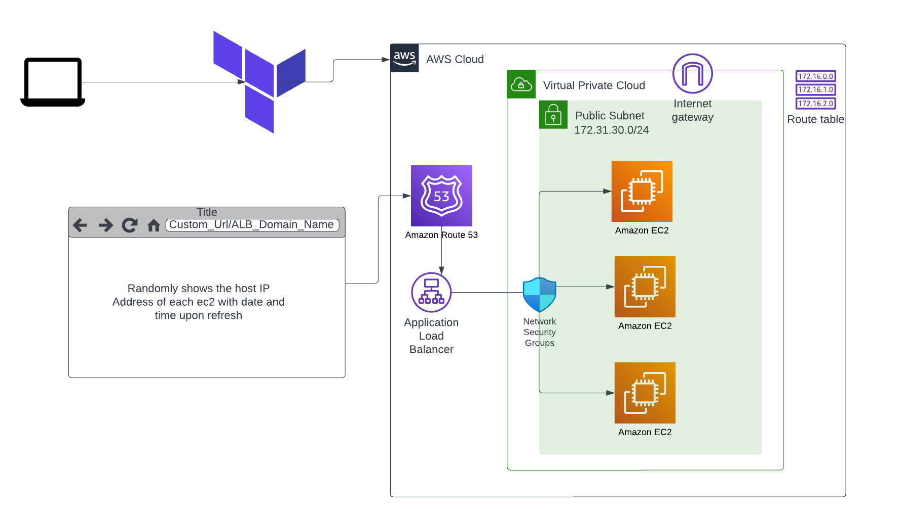

<!-- @format -->



# Use Terraform to deploy an elastic loadbalancer and 3 VMs

1. Clone the Github repository.

1. Move into the `<directoryName>/` directory which contains the Terraform installation scripts.

1. Open the `terraform.tfvars` or `variables.tf` file and replace the values with your desired values

1. Initialize Terraform.

   ```bash
   terraform init
   ```

1. See what resources will be created.

   ```bash
   terraform plan
   ```

1. Create the resources and deploy the sample.

   ```bash
   terraform apply
   ```

   1. If there is a confirmation prompt, type `yes` and hit Enter/Return.

   Note: This step can take about 10 minutes or more. Do not interrupt the process.

Once the Terraform script has finished,you can go back to the console and view your resources

## Clean up

To avoid incurring charges to your account for the resources used in this application

Run the following command:

```sh
terraform destroy
```

# Ansible

Ensure you have ansible already installed on your host system as we are running a local-exec,
Also ensure the ssh-key path is set in the `ansible.cfg` file
