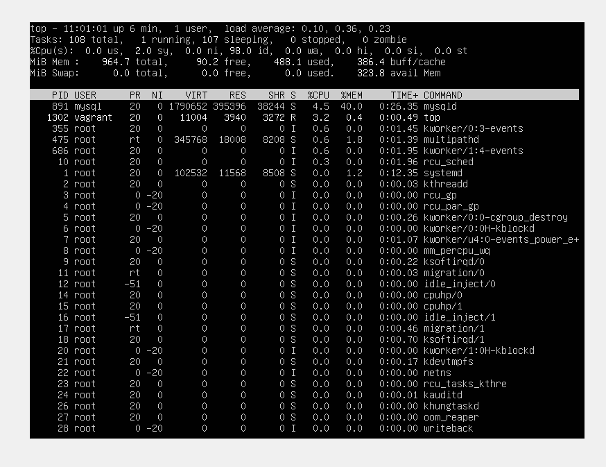

<!-- @format -->

# The Vagrant Ubuntu Cluster


To set up this infrastructure, you can simply just use 1 command `vagrant up` and/or with the `--provision` flag and it will automatically provision and configure the whole set up

```
:~$ vagrant up --provision
```

## Prerequisites

1. A PC or laptop with any OS installed
1. About >8gb of RAM or more (the more the better&&faster)
1. An Internet connection
1. A compatible hypervisor installed eg. Virtualbox,VMware.
1. Vagrant installed
1. A code editor of your choice, in this case Vscode

# 6. Loadbalancer node

In this section, we are going to create a loadbalancer to handle the distribution of traffic between the master node


from our vagrant file under the loadbalancer section, we have a bash script `./loadbalancer.sh` that will install nginx and also configure the `.conf` file automatically. Nb. i had already populated the conf script with the ip address of the other 2 nodes.


Once Vagrant is done provisioning and begins configuring along the way we can check if nginx has been installed, visit your browser and you should be greeted with "welcome to nginx" which means it was installed well


To validate that our loadbalancer is working, you open a browser and input the ip address of the loadbalancer and it should take you the apache welcome page.NB i did some further customisation to make sure that its actually working and edit the `/var/www/html` and input the ip address of each node..so that we can be sure that its actually distributing the traffic

<div style="display: flex; justify-content: space-between;">
    
    
</div>

# 7. Process Monitoring:

On the Master node to display an overview of the Linux process management, showcasing currently running processes, we use the `top` command to display the service.

```
:~$ top
```


it should display an outcome with process lists

.

finally, how the virtualbox dashboard looks like for me will like this


