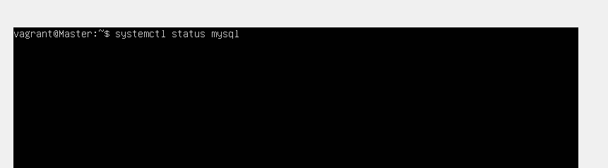

<!-- @format -->

# The Vagrant Ubuntu Cluster


To set up this infrastructure, you can simply just use 1 command `vagrant up` and/or with the `--provision` flag and it will automatically provision and configure the whole set up

```
:~$ vagrant up --provision
```

## Prerequisites

1. A PC or laptop with any OS installed.
1. About >8gb of RAM or more (the more the better&&faster)
1. An Internet connection.
1. A compatible hypervisor installed eg. Virtualbox,VMware, hyper-v.
1. Vagrant installed.
1. A code editor of your choice, in this case Vscode.

# 1. Master Node

First of all, we are going to create a master node, which will serve as the control plane

from our vagrant file under the slave section,we have some bash scripts to automate the setup

The bash script is to create a user and to superuser group `./create_user.sh`, the next is to install the lamp stack `./lamp_stack.sh`

Once Vagrant is done provisioning and begins configuring along the way we can check if apache, mysql and php has been installed, visit your browser and you should be greeted with "it works" from apache which means it was installed well, use the `systemctl status <ServiceName>` to check mysql and `php -v` to check php installation and the other things the bash scripts are too do


A. lets check apache, open your browser and input the master ip address


B. lets check php using the `php -v` commannd

```
:~$ php -v
```


the outcome


C. lets check mysql using the `systemctl status <ServiceName>` commannd (replace servicename with the service in this case mysql)

```
:~$ systemctl status <servicename>
```



the outcome,as you can see mysql is active


### Verifications

we have to ensure the scripts worked

#### A. Check if the user was createrd

The `create_user.sh` script was used to automate the creation of the user, to check you can run the `compgen` command with the `-u` flag and you should see the altschool user created

```
:~$ compgen -u
```


the outcome


#### B. Check if the /mnt/altschool dir was created

the `copy_mnt_slave` creates a directory and a file named content, to check simple try to cd to the directory and `ls` the directory.


#### c. ssh into slave without password

for this stage i prefer to run it after the setup is complete, however the bash scirpt `easy_ssh.sh` automates all the process.. you may need to enter your password for the 1st time after thats all.

<br/>
<br/>
<br/>

# 2. Slave node

In this section, we are going to create a slave node, which will get instructions files from the master node.

from our vagrant file under the slave section, we have a bash script ``./lamp_stack.sh`.sh that will install the lamp stack


Once Vagrant is done provisioning and begins configuring along the way we can check if apache, mysql and php has been installed, visit your browser and you should be greeted with "it works" from apache which means it was installed well, use the `systemctl status <ServiceName>` to check mysql and `php -v` to check php installation


lets check apache, open your browser and input the slave ip address


lets check php using the `php -v` commannd

```
:~$ php -v
```


the outcome


lets check mysql using the `systemctl status <ServiceName>` commannd (replace servicename with the service in this case mysql)

```
:~$ systemctl status <servicename>
```


the outcome,as you can see mysql is active


With that Slave node is ready to go

# 3. Loadbalancer node

In this section, we are going to create a loadbalancer to handle the distribution of traffic between the master node


from our vagrant file under the loadbalancer section, we have a bash script `./loadbalancer.sh` that will install nginx and also configure the `.conf` file automatically. Nb. i had already populated the conf script with the ip address of the other 2 nodes.


Once Vagrant is done provisioning and begins configuring along the way we can check if nginx has been installed, visit your browser and you should be greeted with "welcome to nginx" which means it was installed well


To validate that our loadbalancer is working, you open a browser and input the ip address of the loadbalancer and it should take you the apache welcome page.NB i did some further customisation to make sure that its actually working and edit the `/var/www/html` and input the ip address of each node..so that we can be sure that its actually distributing the traffic

<div style="display: flex; justify-content: space-between;">
    
    
</div>

<br/>

# 4. Process Monitoring:

On the Master node to display an overview of the Linux process management, showcasing currently running processes, we use the `top` command to display the service.

```
:~$ top
```


it should display an outcome with process lists


finally, how the virtualbox dashboard looks like for me will like this


